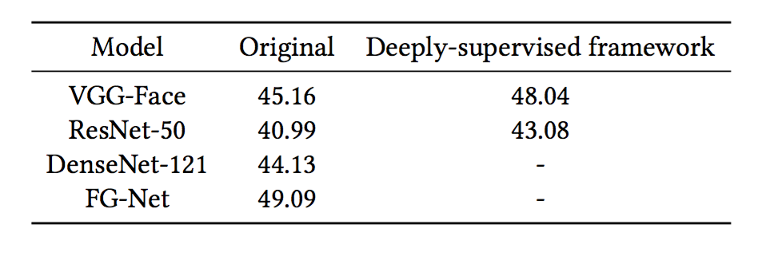
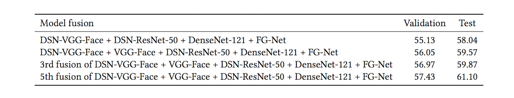

## Video-based Emotion Recognition Using Deeply-Supervised Neural Networks 
An ensemble of proposed models achieves an accuracy of 61.10% in EmotiW 2018.  Details about the EmotiW2016 Challenge can be found at: <https://sites.google.com/view/emotiw2018>. For more details about the codes, please refer to our paper.
### Model accuracy on the validation set:

### Accuracy of our top 4 submissions to EmotiW 2018:


---

## Requirements
pycaffe  
python 2.7  
ffpemg  
cuda 8.0

---

## Datasets and models
1.Datasets:  

Two datasets we used can be downloaded from the [EmotiW 2018](https://sites.google.com/view/emotiw2018,"emoti") and Real-world Affective Faces[RAF-DB](http://www.whdeng.cn/RAF/model1.html,"raf"). You can send an e-mail to the author to access the database. 

2.Models:

To train DSN-VGG-FACE , DSN-Res-50 or DenseNet-121,  
you can finetune using pretrained models from: [VGG-FACE](http://www.robots.ox.ac.uk/~vgg/software/vgg_face/, "vggface"),[ResNet-50](https://github.com/KaimingHe/deep-residual-networks,"res50"),[DenseNet-121](https://github.com/shicai/DenseNet-Caffe,"dense121"). 
```
git clone https://github.com/EvelynFan/DSN.git  
cd ./DSN-VGG-FACE  
python run_dsn.py  
cd ./DSN-Res-50  
python run_dsn_res50.py
```


## Citing
If you find the code useful, please cite: